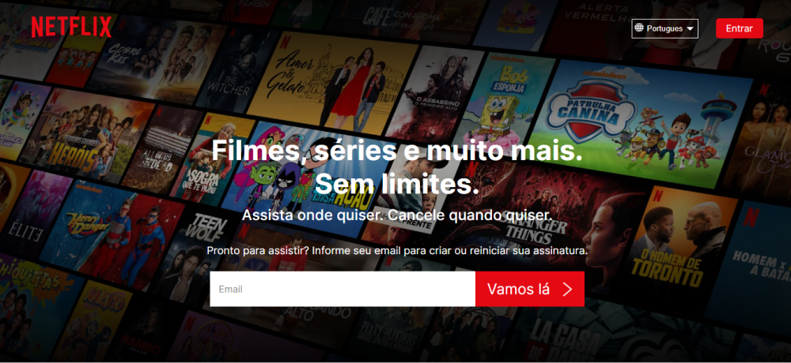
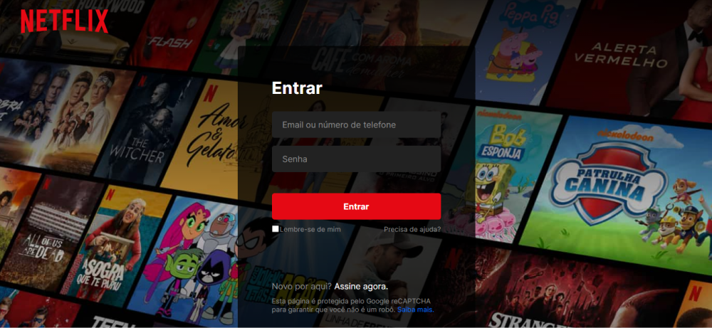

<h1>Clone Netflix</h1>

Eu escolhi copiar este site apenas pelos os motivos de que era simples e poder aprender a usar video responsivo, e
aprimorar minhas habilidades as tecnologias descritas neste readme.

<h2>Cores Utilizadas</h2>
<ul>
  <li>#fff</li>
  <li>#000</li>
  <li>#FFA00A</li>
  <li>#E50914</li>
  <li>#0071eb</li>
  <li>#F40612</li>
  <li>#737373</li>
  <li>#8C8C8C</li>
  <li>#222222</li>
  <li>#303030</li>
  <li>rgba(0,0,0,.75)</li>
  <li>rgb(0, 0, 0, 0.5)</li>
</ul>

<h2>Fonte Family Utilizada</h2>

fonte utilizada : 'Inter', sans-serif

<h2>Breakpoints</h2>

1000px, 750px, 530px

<h2>Tecnologias utilizadas</h2>
<ul>
  <li>HTML</li>
  <li>SCSS</li>
  <li>JavaScript</li>
</ul>

<h2>Familia de fonte Utilizada</h2>

fonte utilizada : 'Inter', sans-serif

caso os videos não estejam funcionando basta clicar no logo.

para abrir a pagina na qual esta o formulario basta clicar no botão de entrar no proprio projeto.

<a href="https://vinicius-pereira-souza.github.io/Netflix-Clone/">Demonstração</a>